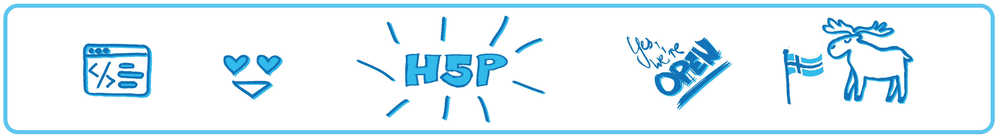
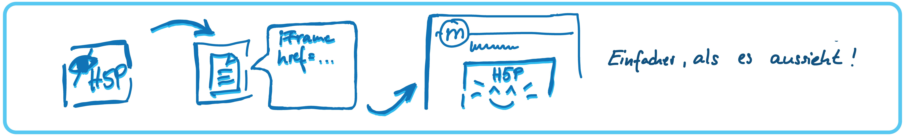
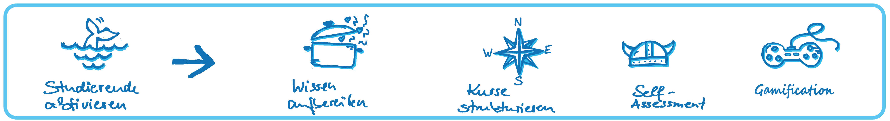
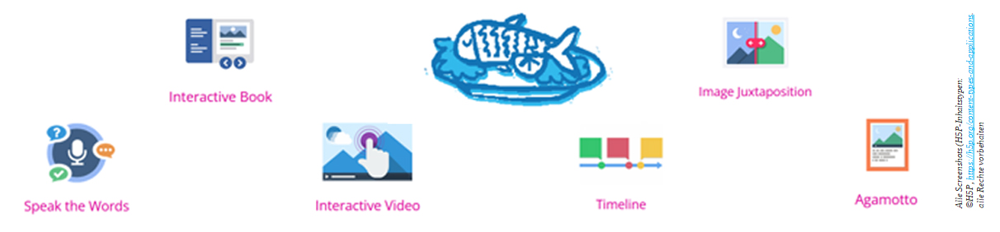
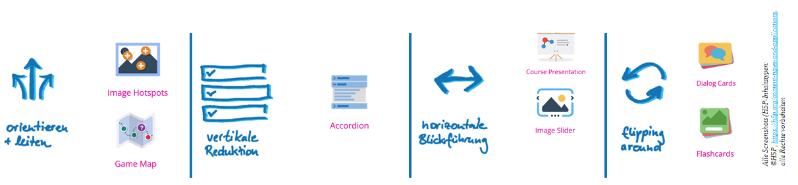
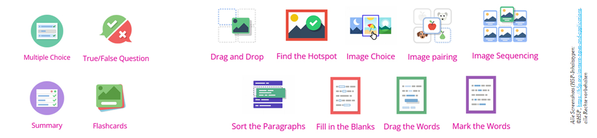
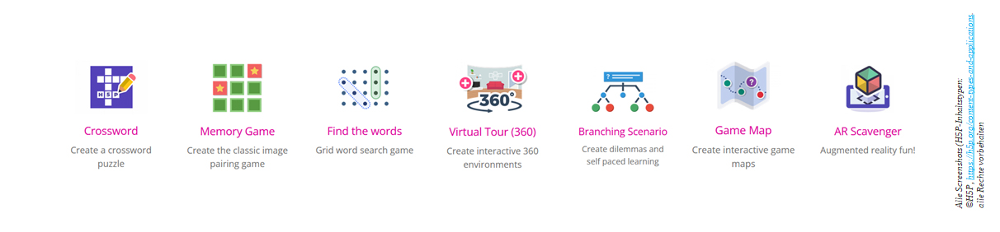

# Herzlich Willkommen!

Dieser Kurs ist darauf ausgerichtet, sowohl theoretisches Wissen als auch praktische Fähigkeiten zu vermitteln, um eigene interaktiven Lernmaterialien erstellen und effektiv und sinnvoll in Lehr-Lern-Szenarien einsetzen können.

> **Zielgruppe** | Lehrende, die ein LMS mit H5P-Integration nutzen (z.B. Moodle)

> **Level** | Einsteiger

> **Metadaten** | H5P; Moodle; Lehr-Lern-Einheit; Struktur; interaktiv; virtuelle Lehre; HTML 5; Digitale Lernumgebung; 

> **Lernziele**:
* einen grundlegenden Überblick über das Tool H5P gewinnen und seine Funktionsweise verstehen
* Das Tool H5P in einer Mikro-Übung praktisch kennenlernen
* Die Einbindungsmöglichkeiten von H5P via iFrame (z.B. in Moodle) kennen und anwenden können
* Den didaktischen Nutzen des Tools reflektieren und für die eigene Lehre adaptieren können
* anhand weiterer bereitgestellter Übungen die Bedienung tiefer nachvollziehen und für die eigene Lehre nutzen können

---

 *Nun aber erst einmal viel Spaß bei den ersten Schritten mit dem "kleinen Alleskönner-Tool"!* 

---

## Was erwartet Dich?

**Der folgende Fahrplan gibt einen Überblick über die Kursstruktur:**

<iframe src="https://h5p.org/h5p/embed/1514564" width="100%" height="300 px" frameborder="0" allowfullscreen="true"></iframe>

>*Ein solcher Lernpfad ist mit dem H5P-Element [Image Hotspots](https://h5p.org/image-hotspots) einfach zu erstellen. Auch für komplexe Ablagestrukturen wie in einem Moodle-Kurs lässt sich für die Lernenden schnell Übersichtlichkeit schaffen. Ein Beispiel für eine Übersicht in Moodle findet sich bei den Beispielen.*

---

 *Jetzt geht es zunächst mit ein paar grundlegenden Hintergrundinformationen zum kleinen Alleskönner-Tool H5P weiter!* 

---

## H5P - Was ist das?

* H5P ist ein Autorentool (Software) zur Erstellung digitaler Bildungsressourcen
* H5P ist das Akronym für **H**TML**5** **P**ackage (Code-Basis)
* entwickelt von der norwegischen Firma Joubel(seit 2022: H5P-Group). Erste Version: 2013
* **Open Source**: Die Software ist kostenfrei und offen lizensiert, d.h. der Code ist öffentlich zugänglich und kann verändert werden  🠒 HP5 ist Teil der **Openess-Bewegung**
* **engagierte Entwickler-Community**, die kollaborativ und kontinuierlich am Code arbeitet
* **Hohe intuitive Bedienbarkeit:**„Wer in Wordpresseinen Blogartikel anlegen und veröffentlichen kann, der wird auch mit H5P zurecht kommen.“ (Nele Hirsch, E-Bildunglabor)

> in der Ursprungsfassung, die für Moodle aufbereitet wurde, war die Einführung als [H5P-Inhaltstyp "Dialog-Cards"](https://h5p.org/h5p/embed/1514563) aufbereitet. Für die Umsetzung in Liascript war die Darstellung weniger geeignet. Das zeigt: Es muss nicht alles interaktiv aufbereitet sein - das Nutzererlebnis steht immer im Vordergrund!

---

 *Soviel zum Hintergrund - was lässt sich nun aber damit tun?* 

---

## H5P - Wie geht das?

H5P stellt über **50 verschiedene Inhaltstypen** als Schablone für die Kombination von Medien zur Verfügung, um OER (Open Educational Resources/Offene Bildungsresourcen) produzieren zu können

> Wichtig: Offene Ressourcen sind nicht gleich offene **Bildungs-**Resourcen!
> Das bedeutet, dass multimediale Elemente (Bilder/Grafiken, Audio und Video) nicht in H5P erstellt werden, sondern vorher gesucht/produziert sein müssen. Sie können dann in die verschiedenen Schablonen eingefügt oder verlinkt werden, bevor sie mit interaktiven Elementen angereichert werden können.

Keine Sorge: Falls Du spontan kein eigenes Material zur Verfügung hast, gibt es am Ende des Kurses eine umfangreiche Linkliste zu Materialpools, die eine gute Grundlage und oder Inspiration darstellen können. Dank offener Lizensierung ist die Nutzung dabei unkompliziert und rechtssicher möglich.

 **Du möchtest H5P am liebsten sofort jetzt sofort ausprobieren? Na dann los! In ca. 10 min. erstellst Du Dein erstes interaktives Element!** 

Die [Anleitung und die Daten zum Micro-Learing gibt es hier](Link):

    Öffne die Webseite [Einstieg H5P](https://einstiegh5p.de/) 
    ... dann gehts los!

    Der Einstieg basiert auf dem H5P-Inhalt [Image Hotspots](https://h5p.org/image-hotspots). 

 

 
    Das Bild eignet sich aber auch gut dazu, das Material [Drag-and-Drop](https://h5p.org/drag-and-drop) auszuprobieren.

<iframe src="https://h5p.org/h5p/embed/1514565" width="100%" height="300" frameborder="0" allowfullscreen="true"></iframe>

 

---

 *Stellt sich nun die Frage: Wie kommt das ganze in meinen Kurs/mein Seminar/meinen virtuellen Klassenraum?* 

---

## H5P als integrierte Ansicht (z.B. in Moodle) - Wie kommt es dahin?

Ein neu angelegtes H5P Element wird auf der Kursebene in Moodle so angezeigt:  

Um es auf der Kursebene als interaktiver Inhalt sicht- und klickbar zu machen, sind folgende Schritte notwendig:

  
<iframe src="https://h5p.org/h5p/embed/1514566" width="100%" height="500" frameborder="0" allowfullscreen="true"></iframe>

---

 *Klingt für einzelne Materialien total spannend, aber die Anwendung für das große Ganze ist noch unklar? Das ändert sich jetzt!* 

---

## H5P - Was kann das?

 **Wissen aufbereiten** 

* Materialschablonen, um Inhalte medial gestützt in verschiedenen Formaten bereitzustellen 

 style="color: #0e75b6;"> **Lehr-Lern-Szenarien strukturieren** 

* Darstellungsvarianz für asynchrone Lerngelegenheiten

 style="color: #0e75b6;"> **Self-Assessment ermöglichen** 

* Lernende im Kontext des Constructive Alignment auf Lernzielkontrollen/Prüfungen vorbereiten

* !! Wichtig!! H5P ist kein Tool für formale Tests !!  

 style="color: #0e75b6;"> **Gamification** 

* Lernende durch spielerische Akzente in der Wissensaufbereitung und -vertiefung motivieren

---

 *alle Schwerpunkte werden im Folgenden genauer beleuchtet und mit guten Praxisbeispielen versehen. Im Abschnitt XXX findet sich zudem weitere Materialpools zu H5P und offenen (Bildungs-)Resourcen für mehr Inspiration und als Grundlage zur Weiternutzung.* 

---

### Wissen aufbereiten  
Hier liegt der Fokus darauf, **Informationen klar, kompakt und einprägsam zu vermitteln**. Optische Elemente setzen Ankerpunkte, lockern lange Texte auf und fördern nachhaltiges Verstehen. Entscheidend ist der Mehrwert der Aufbereitung, der dafür sorgt, dass Inhalte im Gedächtnis bleiben. Es gilt der alte Spruch: Der Fisch muss nicht dem Angler schmecken!

> *Die ***Timeline*** eignet sich für alle Arten zeitlicher Abläufe, was die Abläufe von Experimenten ermöglicht. Im [Versuchsaufbau Essigherstellung](https://h5p.org/node/1514726?feed_me=nps) lassen sich über die verschiedenen Kategorien lassen sich diese auch in unterschiedlichen Ebenen abbilden – im Beispiel: Wann der Zeitpunkt ist, etwas zu tun, wann etwas beobachtet werden kann und was der unsichtbare Prozess im Hintergrund ist.*

> ***Image Juxtaposition*** *eignet sich hervorragend, um Veränderungen zwischen zwei Bildern im Detail zu vergleichen. Das H5P-Beispiel beinhalten [Luftbilder und Steady-Cam-Bilder](https://h5p.org/image-juxtaposition#example=64227), es kann aber auch verschiedene Sichtbarkeiten übereinanderblenden, wie zum Beispiel die [thermische Signatur eines Handabdrucks auf einer Tischplatte](https://h5p.org/node/494915), oder physiologische Veränderungen, wie die [Organverschiebung während der Schwangerschaft](https://h5pstudio.ecampusontario.ca/content/10632).*

> *Mit dem ***Agamotto*** ist ein H5P-Inhaltstyp, der durch schrittweises Überblenden beliebig vieler Bilder ermöglicht, Details entdecken und Zusammenhänge verstehen. Es kann für den [Aufbau geographischer Daten oder Prozesse in Karten](https://h5p.org/content-types/agamotto#example=79243), für die Simulation eines [stufenweisen Zooms auf mikroskopische Strukturen](https://h5p.org/content-types/agamotto#example=79368), oder aber auch zum [Storytelling und für schrittweise Lösungshinweise](https://herrmess.de/2021/05/01/h5p-ole-folge-12-agamotto/) verwendet werden.*

Eine weitere Möglichkeit zur Gestaltung von Lerneinheiten ist die Kombination mehrerer Inhaltstypen in einem interaktiven Format. So entstehen kompakte und vielseitige Materialien, die Lernenden abwechslungsreiche, asynchrone Lerngelegenheiten bieten.

> *Das* ***interaktive Buch*** *vereint verschiedene H5P-Inhaltstypen sowie Texte, Videos und Bilder, sodass eine umfassende Lernerfahrung entsteht. Lerneinheiten können so als Paket für Lernende geschnürt werden, die im eigenen Tempo bearbeitet werden können. Es ist universell einsetzbar, sei es im [Sprachunterricht](https://ecampusontario.pressbooks.pub/introspanishworkbook/chapter/1a-1-verdadero-o-falso/), als Instrument für hochschuldidaktische Themen wie [Prüfungsformen](https://www.zoerr.de/edu-sharing/components/render/43b1a786-627f-4d8c-8a3c-b12def68dcb5) oder [Kommunikationstechniken](https://www.zoerr.de/edu-sharing/components/render/af09665b-9edd-471b-8616-31bb70bc4efa)auch als Alternative zu Moodle- und Ilias Kursen, wie der [OER-Wissenspool](https://www.twillo.de/edu-sharing/components/render/2345cca5-7ef3-4a5c-90cb-1433b3401b47), der für diverse Formate aufbereitet wurde.*

> *Das* ***interaktive Video*** *wird nicht nur konsumiert: Es kann mit Markern versehen werden, um die [Navigation innerhalb eines Videos](https://www.twillo.de/edu-sharing/components/render/531ffd01-8ac9-41f7-b6f8-cab1d581d14b) zu ermöglichen. [Grundlegende Begriffe zu einem Thema können eingeführt](https://apps.zum.de/apps/31454)und über Quizfragen dieses neu erworbene Wissen direkt vertieft werden. Das Videomaterial wird meist spezifisch für den Anwendungskontext produziert, (vor allem außerhalb der Schranken der Lehre) vorhandenes Material selten passgenau vorhanden ist. Auch wenn dies sehr aufwändig klingt, es gibt Varianten die keine Dreharbeiten erfordern, wie [Legevideos](https://h5p.org/node/1514745) oder [Screencasts](https://apps.zum.de/apps/37652). Bedarf es allerdings doch Dreharbeiten, kann im Storytelling der Konzeption die interaktive Nachbereitung bereits mitgedacht werden.*

### Kurse strukturieren

Eine klare Struktur hilft, Orientierung zu schaffen und den Lernweg sinnvoll zu gestalten. Das Ziel ist es, die Navigation für Lernende intuitiver zu machen und die Nutzererfahrung im digitalen Lernraum zu optimieren.

> *Mit* ***Image Hotspots*** *lässt sich ein Überblick über einen Kurs verschaffen (so auch in diesem Kurs). Ein weiteres gelungenes Beispiel (mit Leseempfehlung) ist [Lernlandkarte didaktischer Themenfelder](https://www.edulabs.uni-koeln.de/ilias.php?ref_id=11069&cmdClass=ilrepositorygui&cmdNode=xi&baseClass=ilRepositoryGUI). Es ist auch möglich, eine komplette [Kursstruktur als Inhaltsverzeichnis](https://h5p.org/node/1514750) abzubilden, die als wachsende Struktur auch im Semester eingesetzt werden kann.*

> *Der Inhaltstyp* ***[Accordion](https://h5p.org/accordion)*** *ermöglicht es, Inhalte ein- und auszuklappen. Das kann genutzt werden, um ausführliche Erläuterungen zu Begriffen, Konzeptnamen oder Thesen zu hinterlegen, den Scrollweg aber abzukürzen. oder aber auch zum Hinterlegen von Musterlösungen hinter Fragen, die Lernende zunächst im Self-Assessment beantworten können.*

> *Die ***Course-Presentation*** erlaubt es in die horizontale Navigation zu wechseln – für [komplexere Themenblöcke](https://h5pstudio.ecampusontario.ca/content/47195), der [Organisation von Kleingruppen](https://apps.zum.de/apps/33428) oder auch nur als [Paket aufeinander aufbauender Aufgaben](https://apps.zum.de/apps/37161).*

> *Ist nur eine bildliche Darstellung notwendig, empfiehlt sich der* ***[Image-Slider](https://apps.zum.de/apps/29684)***

> *Der Inhaltstyp* ***Dialog-Cards*** *gehört fast schon zu den spielerischen Varianten – per Klick werden Informationskarten umgedreht. In Moodle ein schöner Effekt, der Kurse auflockern kann um [Definitionen oder Kernfakten](https://h5pstudio.ecampusontario.ca/content/65495) hervorzuheben – oder um [(Reflexions-)Fragen](https://h5pstudio.ecampusontario.ca/content/77165)erst später aufzulösen. Der Mehrwert zum Accordion ist hier die Möglichkeit, Bildmaterial einzubinden.*

### Self-Assessment ermöglichen – dank vielfältiger Frage- und Aufgabentypen

H5P bietet eine breite Palette von Frage- und Aufgabentypen, die zur Vor- und Nachbereitung von Veranstaltungen oder für die Wissensabfrage in der Selbstlernphase ideal sind. Sie können Inhalte flexibel darstellen und Lernende aktiv einbinden. Dabei eignen sich die verschiedenen Typen nicht nur für klassische Fragen, sondern auch für interaktive, visuelle und kombinierte Aufgaben.

*Achtung: geeignet zur Vor- und Nachbereitung von Veranstaltungen oder Wissensabfrage in der Selbstlernphase - H5P eignet sich nicht für formale Tests!*

 
> *Im* ***[Quiz (Question Set)](https://www.twillo.de/edu-sharing/components/render/587d9a6c-9889-440d-ba19-2f16d2d5f23b)*** *sind diverse Fragetypen abgedeckt - über die klassischen [Ja/Nein](https://h5p.org/true-false)*** *,* ***[Single-](https://h5p.org/single-choice-set)*** *und* ***[Multiple-Choice](https://h5p.org/multichoice)*** *Fragen hinaus.*

> *Zuordnungs-Aufgaben können mit der* ***Drag&Drop Mechanik](https://h5p.org/node/1514744)*** *realisiert werden. Es gibt einzelne H5P-Schablonen sowohl für* ***[Lückentexte]( https://h5p.org/advanced-fill-the-blanks)*** *als auch für* ***[Bilder (Image Pairing](https://h5p.org/image-pairing)***. *Besonderes Highlight: Die Umsetzung eines D&D als* ***[Puzzle zum Stickstoffkreislauf](https://apps.zum.de/apps/22045)*** *!*

> *Auch* ***Suchen und Finden*** *ist möglich, z.B. über* ***[Find the Hotspot](https://h5p.org/image-hotspot-question)*** *, oder auch im weiteren Sinne für Text durch* ***[Markieren von Worten](https://h5p.org/mark-the-words)*** *und* ***[Bild/Medien-Auswahl](https://h5p.org/content-types/image-choice)*** *.*

> *Sortiert werden können sowohl* ***[Texte (Absätze/Paragraphs](https://h5p.org/content-types/sort-the-paragraphs)*** *als auch* ***[Bilder (Image Sequencing](https://h5p.org/content-types/image-sequencing)*** *.*

Aufgabentypen mit **Freitext- oder Spracheingaben** wurden bewusst ausgelassen, da diese sich in Moodle besser über Abgaben realisieren lassen.

### Gamification

Gamification bindet spielerische Elemente in Lernprozessen ein – für eine höhere Motivation und aktives Engagement der Lernenden. Dabei kann Gamification von einfachen Übungen bis hin zu komplexen, interaktiven Szenarien reichen. Hier sind einige inspirierende Beispiele, wie Spielelemente in verschiedenen Lernkontexten integriert werden können:

> *Die Klassiker reichen vom* ***[Kreuzworträtsel](https://h5p.manni-dreier.de/?p=173)*** *über* ***[Memory](https://h5p.org/node/1514754)*** *bis zum* ***[Buchstabensalat (Find the Words)](https://apps.zum.de/apps/21210)*** *, in die durchaus auch Fachwissen transportiert werden kann.*

> *Über die* ***[Game Map](https://h5p.org/content-types/game-map)*** *lassen sich Stationen definieren, wobei verschiedene H5P-Inhaltsypen miteinander verknüpft werden können – inklusive optionaler Zeitbegrenzung und Freischaltung weiterer Bereiche der Karte. Obwohl noch ein sehr junger Inhaltstyp (von 2023) gibt es bereits viele tolle Beispiele, unter anderem die lizenzrechtlich unbedenkliche Variante von [Wer wird Millionär?](https://apps.zum.de/apps/33868).*

> *Das* ***[Branching Szanario](https://h5p.org/branching-scenario#example=440740)*** *ist die wohl komplexeste H5P-Aktivität. Best Practice ist das preisgekrönte Serious Game eines Toronto'er Hochschulkonsortiums [Skills Practice: A Home Visit](https://h5p.org/branching-scenario) in dem ein Hausbesuch aus der Perspektive einer/eines Sozialarbeitenden erlebbar gemacht wird. Auch Umsetzungen von [Escape-Rätseln](https://deutsch-lernen.zum.de/wiki/Branching_Scenario_(H5P)) sind möglich.*
 
> *Last but not least ermöglicht die* ***Virtual Tour (360)*** *die interaktive Erkundung von Orten, zum Beispiel des [Forum Romanums](https://herrmess.de/2020/11/23/h5p-ole-teil-8-virtual-tour-360/) – oder aber (leider noch nicht verlinkbar) das virtuelle Kennenlernen von Hochschul-Laboren. Tipps zur Erstellung gibt es im [Webinar von Oliver Tacke](https://www.oercamp.de/webinare/h5p/h5pvt360/).*

## Nachspielzeit - H5P Übungen intensiv ausprobieren---

Die folgenden drei Übungsszenarien (samt Materialkoffer) zu den interaktiven H5P-Büchern beinhalten unterschiedliche Kombinationen von H5P-Inhaltstypen. Sie wurden Stefanie Legler und Laura Schaffeld im Rahmen der [Praxiswerkstatt 2023 des Netzwerks ORCA.nrw](https://www.orca.nrw/praxiswerkstatt-oer) für den Workshop „Interaktive Lehre leicht gemacht - Lerneinheiten mit H5P erstellen“ erstellt.

Hier werden Sie schrittweise durch die Erstellung von H5P-Elementen herangeführt. Das interaktive Buch ermöglicht die Kombination verschiedener H5P-Elemente, ohne dass sie eine LMS-Struktur benötigen.

<!-- Text-Spalte -->

**Interaktives Buch | Schwierigkeitsgrad: Einsteiger**

Die bebilderte <a href="Link zur Anleitung">Anleitung</a> führt Sie per textlichen Schrittabfolgen zu dem in der Vorschau gezeigten Ergebnis.
<a href="Link zu den Daten">Die Daten können hier heruntergeladen werden</a>.

**Im Anschluss können Sie in H5P:** 
- In interaktiven Büchern Text- und Bildelemente austauschen und neu anlegen 
- Das H5P-Element **Dialog Card** anlegen 
- Das H5P-Element **Lückentext** anlegen 
- Das H5P-Element **Collage** anlegen 
- Das H5P-Element **Accordion** anlegen 
- Das H5P-Element **Find the Hotspot** anlegen 

**Viel Spaß beim Klicken und Ausprobieren!**

<!-- Video-Spalte -->

<video width="100%" height="auto" autoplay loop muted>
  <source src="Zusatzmaterial/VideoGrünZusammenschnitt.mp4" type="video/mp4">
  Ihr Browser unterstützt dieses Video nicht.
*Videos/Screenshots: Laura Schaffelt, 2023, alle Rechte vorbehalten*

</video>

 
---
 

<!-- Text-Spalte -->

**Interaktives Buch | Schwierigkeitsgrad: Medium**

Die bebilderte <a href="Link zur Anleitung">Anleitung</a> führt Sie per textlichen Schrittabfolgen zu dem in der Vorschau gezeigten Ergebnis.
<a href="Link zu den Daten">Die Daten können hier heruntergeladen werden</a>.

**Im Anschluss können Sie in H5P:** 
- In interaktiven Büchern Text-, Bild und Tabellenelemente austauschen und neu anlegen 
- Das H5P-Element **Timeline** importieren und anpassen 
- Das H5P-Element **Guess the answer** anlegen und duplizieren 
- Das H5P-Element **Image Choice** anlegen 
- Das H5P-Element **Memory Game** anlegen 

**Viel Spaß beim Klicken und Ausprobieren!**

<!-- Video-Spalte -->

<video width="100%" height="auto" autoplay loop muted>
  <source src="Zusatzmaterial/Sequenz 01.mp4" type="video/mp4">
  Ihr Browser unterstützt dieses Video nicht.
*Videos/Screenshots: Laura Schaffelt, 2023, alle Rechte vorbehalten*

</video>

 
---
 

<!-- Text-Spalte -->

**Interaktives Buch | Schwierigkeitsgrad: Fortgeschritten**

Die bebilderte <a href="Link zur Anleitung">Anleitung</a> führt Sie per textlichen Schrittabfolgen zu dem in der Vorschau gezeigten Ergebnis.
<a href="Link zu den Daten">Die Daten können hier heruntergeladen werden</a>.

**Im Anschluss können Sie in H5P:** 
- In interaktiven Büchern Text-, Bild und Videoelemente einfügen -
- Bild- und Videoelemente austauschen und neu anlegen 
- Das H5P-Element **Image-Slider** anlegen 
- Das H5P-Element **Agamotto** anlegen 
- Das H5P-Element **Drag-and-Drop** anlegen 

**Viel Spaß beim Klicken und Ausprobieren!**

<!-- Video-Spalte -->

<video width="100%" height="auto" autoplay loop muted>
  <source src="Zusatzmaterial/VideoRotZusammenschnitt.mp4" type="video/mp4">
  Ihr Browser unterstützt dieses Video nicht.
*Videos/Screenshots: Laura Schaffelt, 2023, alle Rechte vorbehalten*

</video>

---   
    
## weitereführende Links und Infos

**Das Skript zum Kurs mit allen Infos** Link (zu groß für Github)
*In der Powerpoint-Datei gibt es die "extended Version" zum Mitlesen in den Foliennotizen.

**Beispiele für H5P-Inhaltstypen | von H5P.org Link/URL**
*H5P.org bietet für jeden Inhaltstyp ein Beispiel, dass über den "Wiedernutzungsbutton auch einfach übernommen werden kann.*
   
--- folien auseinandernehmen, material hhu/uni köln
--- verweis auf oersi, landesportale - orca 

**Blog: Gedankensplitter (Peter Baumgartner)**
In der Sammlung ["Selbstbestimmtes Lernen mit H5P"](https://peter.baumgartner.name/sammlungen/h5p-module/) beschreibt Peter Baumgartner didaktische Settings einzelner H5P-Module für selbstorganisierende Lernende.
Im [“Didaktischen Design mit H5P“](https://peter.baumgartner.name/sammlungen/didaktisches-design-mit-h5p/) geht er didaktischen Ideen und Fallstricken bei der Verwendung von H5P-Elementen nach und diskutiert eigene gelungene wie fehlgeschlagene Prototypen und [Experimente](https://peter.baumgartner.name/sammlungen/h5p-experimente/) im Sinne eines Proof of Concept.

**Blog: E-Bildungslabor (Nele Hirsch)**
Nele Hirsch teilt [schnelle Ideen für den kreativen Einsatz von H5P](https://ebildungslabor.de/blog/schnelle-ideen-zu-h5p/), außerdem hat sie einen übersichtlichen [Selbstlernkurs zu H5P](https://lernen.oncampus.de/blocks/ocproducts/product.php?id=a02ed13032f0d5478380bab6e7486138) als OER bereitgestellt

**OER-Camp –SummOER-School mit Oliver Tacke**
Auch Oliver Tacke hat im Rahmen des OER Camp 2020 einen [Selbstlernkurs zu H5P](https://campus.oercamp.de/kurs/h5p/?fbclid=IwAR3arOml6JacuDV-DQYKoK8FxJw8GMOQ9d6L_1Oze61xF6go6SuZRV7XCck) er-und bereitgestellt. Sehenswert zum Einstieg auch sein [Vorstellungsvideo zu H5P (englisch)](https://www.youtube.com/watch?v=2HtxLeXGU48&t=197s).

**Landesbildungsserver Baden-Württemberg**
Das Schulportal stellt [Anleitungen für das Erstellen von interaktiven Übungen mit H5P](https://www.schule-bw.de/themen-und-impulse/medienbildung/interaktiv/anleitung-h5p) bereit und gibt dabei eine gute Übersicht darüber, wie [Urheberrechtsangaben eingefügt und angezeigt](https://www.schule-bw.de/themen-und-impulse/medienbildung/interaktiv/anleitung-h5p/h5p-einfuegen-urheberrecht.html) werden können.

*Die Links zu den Inspriationen basieren u.a. auf Blogbeiträgen von [Christina Bliss für wb-web.de](https://wb-web.de/aktuelles/h5p-interaktive-inhalte-und-aufgaben-erstellen.html) und [Marc Albrecht-Hermanns](https://wakelet.com/wake/Efe8O1kTJwM38fC1xlPWD)*

# Impressum 
    
> Version 1.0 vom 14.05.2024

Dieser Kurs steht – ausgenommen verwendeter Wort-Bildmarken und anders gekennzeichneter Elemente – unter einer [CC BY-4.0 Lizenz](https://creativecommons.org/licenses/by/4.0/deed.de). Sie dürfen die Inhalte vervielfältigen, verwenden, verarbeiten, vermischen und verbreiten unter der Bedingung, dass Sie die Originalautorin nennen.

** Urheber:in(nen):**
Stefanie Legler & Laura Schaffeld für das Projekt Netzwerk ORCA.nrw 
Version 1.0 vom 14.05.2024
 
> Wir empfehlen folgende Angabe bei Weiternutzung: 
> Der Kurs „H5P[at]HRW“ von Stefanie Legler ist lizenziert unter einer CC BY 4.0 International Lizenz (https://creativecommons.org/licenses/by/4.0/). 
> Ausgenommen von der Lizenz sind die verwendeten Wort-/Bildmarken und alle anders gekennzeichneten Elemente. Ursprungsort: [Liascript](https://liascript.github.io/course/?https://raw.githubusercontent.com/Steffi82/H5P-Struktur-Moodle/refs/heads/main/H5P-Struktur-Moodle.md#1) via [Github](https://github.com/Steffi82/H5P-Struktur-Moodle)

**Bildnachweise**
Einzelnachweise der Medien stehen direkt an den Medien. Nicht CC-lizenzierte Medienobjekte sind als solche gekennzeichnet. Falls eine Bezeichnung fehlt, ist davon auszugehen, dass sie nicht offen lizensiert und von der Gesamtlizenz des Kurses ausgenommen ist
